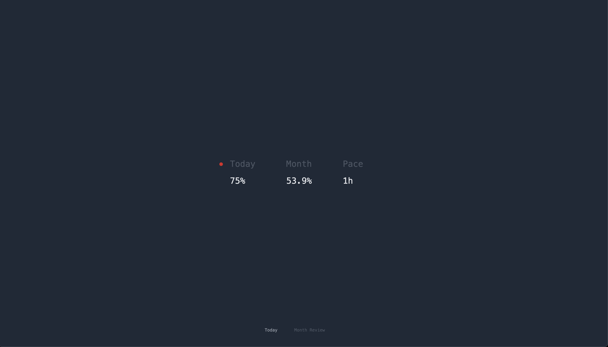
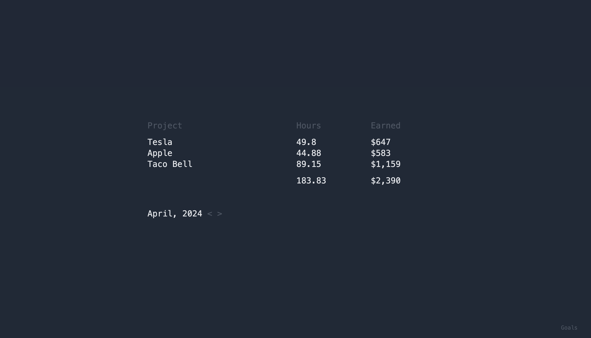

# myspace

Shows time tracked with enabled sources (app/Services/Api/*).
Supports daily and monthly goals (see .env).





## Setup

```
cp .env.example .env
composer install
php artisan migrate
npm install
npm run build
```

There are 3 common options to self-host:
1. `php artisan serve` 
2. `valet up`
3. `sails up`

To make /today run smoother use queue driver other than sync.
